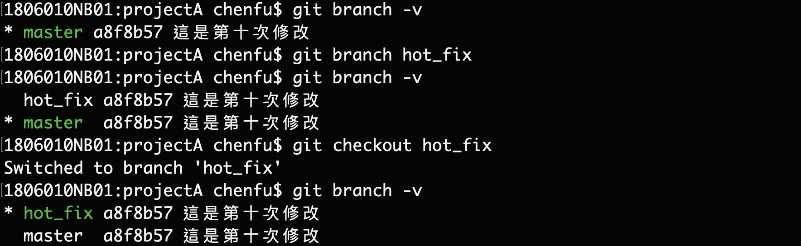

版本控制工具:Git
==================
*   [版本控制工具應該具備的功能](#ch01)
*   [版本控制簡介](#ch02)
*   [Git簡介](#ch03)
*   [Git命令操作](#ch04)
*   [Git基本原理](#ch05)
*   [局域網路代碼託管中心(GitLab)](#ch06)

* * *
<h2 id="ch01">1. 版本控制工具應該具備的功能</h2>

    協同修改 : 多人並行不悖的修改服務器端的同一個文件。
    數據備份 : 不僅保存目錄和文件的當前狀態，還能夠保存每一個提交過的歷史狀態。
    版本管理 : 在保存每個版本文件訊息的時候，要做到不保存重複數據以節約存儲空間提高運行效率。
                Tip:SVN採用增量式管理、Git採用文件系統快照。
    權限控制 : 對專案團隊內的開發人員進行權限控制、對專案團隊外的開發人員提供代碼審核機制。
                Tip:審核機制Git獨有。
	歷史紀錄 : 查看修改人員、修改時間、修改內容、日誌訊息、將本地文件恢復到某個歷史狀態。
	分支管理 : 允許開發團隊在工作過程中多條生產線同時推進任務，進一步提高效率。

<h2 id="ch02">2. 版本控制簡介</h2>
&nbsp;&nbsp;2-1.&nbsp;&nbsp;版本控制

    工程設計領域 : 使用版本控制管理工程藍圖的設計過程。
    軟體開發領域 : 使用版本控制思想管理代碼的版本迭代。

&nbsp;&nbsp;2-2.&nbsp;&nbsp;版本控制架構
  
&nbsp;&nbsp;2-3.&nbsp;&nbsp;版本控制工具

	(集中式)版本控制工具:
		SVN、CVS、VSS ...
	(分散式)版本控制工具:
		Git、Mercurial、Bazaar、Darcs ...

<h2 id="ch03">3. Git簡介</h2>
 &nbsp;&nbsp;3-1.&nbsp;&nbsp;官網
 &nbsp;&nbsp;3-2.&nbsp;&nbsp;優勢

    *  大部分操作都在本地完成，不需要聯網支持。
    *  完整性保證。
    *  盡可能添加數據而不是刪除或修改數據。
    *  分支操作非常快捷流暢。
    *  與Linux命令全面兼容。
 &nbsp;&nbsp;3-3.&nbsp;&nbsp;結構
  

 &nbsp;&nbsp;3-4.&nbsp;&nbsp;Git和代碼託管中心
 &nbsp;&nbsp;&nbsp;&nbsp;主要的功能是維護遠程庫

	(局域環境)的代碼託管中心:
        GitLab服務器
	(外部環境)的代碼託管中心:
        GitHub,碼雲

 &nbsp;&nbsp;3-5.&nbsp;&nbsp;本地倉庫與遠程倉庫的交互方式

    代碼托管中心:GitHub,GitLab
    一. 團隊內部協作
        ＊ 團隊領導擁有代碼託管中心的最高權限。
        ＊ 多數的時間會使用 git push(推送代碼)與 git pull(拉取代碼)來完成工作項目。
        ＊ 首次的開發者可用 git clone(克隆代碼)，將專案整份克隆到自己的本地庫。
    二. 跨團隊協作
        ＊ 由A團領導在代碼託管中心發起fork指令，B團隊領導透過該指令在自己的代碼託管中心複製一份相同的遠程庫專案。
        ＊ B團隊成員就能透過團隊內部協作的方式完成指定代碼開發，擁有所有內部開發的權限。
        ＊ 完成開發時B團隊領導可以在自己的代碼託管中心發起pull request(拉取請求)此時A團隊領導可以在自己的
           代碼託管中心確認推送的代碼，只要審核沒問題則使用merge指令合併到自己的專案中，完成此次跨團隊合作。
  

<h2 id="ch04">4. Git命令操作</h2>
 &nbsp;&nbsp;4-1.&nbsp;&nbsp;本地庫初始化
 &nbsp;&nbsp;4-1-1.&nbsp;&nbsp;建立版本控制

    參數命令: git init
    注意事項: 該命令會產生一個 .git 目錄是存放本地庫相關的子目錄和文件，紀錄該資料夾內所有異動不可胡亂修改，如果想移除版本控制,則刪除該目錄即可。
&nbsp;&nbsp;&nbsp;&nbsp;執行效果:
  
&nbsp;&nbsp;&nbsp;&nbsp;目錄結構:
  
 &nbsp;&nbsp;4-1-2.&nbsp;&nbsp;設置簽名檔

    形式:
        user.name
        user.email
    作用: 區分不同開發人員之身份，基本上用於本地資料庫的範圍
    注意: 此區設置的簽名與登陸遠程庫(GitLab,GitHub)的帳號密碼沒有任何關係
	命令:
		項目級別/倉庫級別: 僅在當前目錄範圍        (參數保存位置 ./.git/config)
			git config user.name  "使用者名稱"
			git config user.email "使用者郵件"
        系統用戶級別: 當前系統的用戶範圍           (參數保存位置 ~/.gitconfig)
			git config --global user.name  "使用者名稱"
			git config --global user.email "使用者郵件"
		級別優先級
            就近原則:項目用戶級別 > 系統用戶級別(至少要有一項)
&nbsp;&nbsp;&nbsp;&nbsp;執行效果:
  
 &nbsp;&nbsp;4-2.&nbsp;&nbsp;基本操作
 &nbsp;&nbsp;4-2-1.&nbsp;&nbsp;狀態查看操作

    命令: git status
    作用: 查看工作區/暫存區狀態。
&nbsp;&nbsp;&nbsp;&nbsp;執行效果: 
 &nbsp;&nbsp;&nbsp;&nbsp;        on branch master  (目前的分支為master)
 &nbsp;&nbsp;&nbsp;&nbsp;        no commits yet    (沒有任何版本被提交)
 &nbsp;&nbsp;&nbsp;&nbsp;        nothing to commit (該目錄下被追蹤的資料沒有任何異動需要被提交)
  
 &nbsp;&nbsp;4-2-2.&nbsp;&nbsp;添加操作

    命令: git add [fileName]
    作用: 將工作區的"新建/修改"添加至暫存區。
&nbsp;&nbsp;&nbsp;&nbsp;執行效果:
 (操作前) 
 &nbsp;&nbsp;&nbsp;&nbsp;        on branch master  (目前的分支為master)
 &nbsp;&nbsp;&nbsp;&nbsp;        no commits yet    (沒有任何版本被提交)
 &nbsp;&nbsp;&nbsp;&nbsp;        untracked files   (未被追蹤的檔案如下)
 &nbsp;&nbsp;&nbsp;&nbsp;        nothing added to commit but untracked files present    (該目錄下被追蹤的資料沒有任何異動需要被提交，但是目前出現尚未被追蹤的檔案)
  
 (操作後)
 &nbsp;&nbsp;&nbsp;&nbsp;        on branch master (目前的分支為master)
 &nbsp;&nbsp;&nbsp;&nbsp;        no commits yet (沒有任何版本被提交)
 &nbsp;&nbsp;&nbsp;&nbsp;        changes to be committed (多筆被追蹤的資料發生改變，等待被完成提交)
  
 &nbsp;&nbsp;4-2-3.&nbsp;&nbsp;移除操作

    命令: git rm --cached [fileName]
    作用: 將特定資料從暫存區裡移除。
&nbsp;&nbsp;&nbsp;&nbsp;執行效果:
  
 &nbsp;&nbsp;4-2-3.&nbsp;&nbsp;提交操作

    命令: git commit -m "這邊放訊息字串"
    作用: 將暫存區的內容提交到本地庫。
&nbsp;&nbsp;&nbsp;&nbsp;執行效果:
  

 &nbsp;&nbsp;4-2-4.&nbsp;&nbsp;查看歷史紀錄操作

    (方式一)
        命令: git log
        作用: 查看詳細的歷史紀錄。(空白鍵:向下翻閱 B鍵:向上翻閱 Q:退出日誌)
&nbsp;&nbsp;&nbsp;&nbsp;執行效果:
  	

    (方式二)
        命令: git log --pretty=oneline
        作用: 顯示當前版本及過往的版本(標示當前版本，顯示哈希碼與提交訊息)
&nbsp;&nbsp;&nbsp;&nbsp;執行效果:
  

    (方式三)
        命令: git log --oneline
        作用: 顯示當前版本及過往的版本(標示當前版本，顯示"精簡版"哈希碼與提交訊息)
&nbsp;&nbsp;&nbsp;&nbsp;執行效果:
  

    (方式四)
    命令: git reflog 
	作用: 顯示當前版本及過往的版本。(在oneline的基礎多加上HEAD參數)
&nbsp;&nbsp;&nbsp;&nbsp;執行效果:
 &nbsp;&nbsp;&nbsp;&nbsp; HEAD@{當前移動到該版本需要的步數}
  
 &nbsp;&nbsp;4-2-5.&nbsp;&nbsp;歷史紀錄前進與後退
 &nbsp;&nbsp;&nbsp;&nbsp;本質: Git會透過指針(HEAD)上下移動的方式來管理歷史紀錄與版本的前進與回退。
  
 &nbsp;&nbsp;&nbsp;&nbsp;透過索引值操作[推薦使用]:

    命令: git reset --hard [局部索引值]
	作用: 回到指定索引值的版本
&nbsp;&nbsp;&nbsp;&nbsp;執行效果:
 &nbsp;&nbsp;&nbsp;&nbsp;HEAD is now at  [局部索引值]  版本訊息 
  

    (使用 ^ 符號)
        命令: git reset --hard HEAD^ 
        作用: 只能後退，依當前版本為基準，回到上個版本。(ps:幾個^ 就往前幾個版本)
    (使用 ~ 符號)
        命令: git reset --hard HEAD~n 
        作用: 只能後退，依當前版本為基準，回到前n個版本。(ps: 想回到前幾個版本n就填多少，且n為正整數)
&nbsp;&nbsp;&nbsp;&nbsp;執行效果:
  
 &nbsp;&nbsp;4-2-5-1.&nbsp;&nbsp;刪除文件並找回
 &nbsp;&nbsp;&nbsp;&nbsp;只要是曾經提交至本地庫的檔案就一定有保存資料，若要找回特定檔案可透過reset命令。

    reset 命令的三個參數對比
        前提: 該檔案曾經提交至本地庫。
    (soft參數)
        命令: git reset --soft [局部索引值]
        作用: 1) 異動本地庫的指針(HEAD) 至指定的局部索引值
    (mixed參數)
        命令: git reset --mixed [局部索引值]
        作用: 1) 異動本地庫的指針(HEAD) 2)重置暫存區 至指定的局部索引值    
    (hard參數)
        命令: git reset --hard [局部索引值] 
        作用: 1)異動本地庫的指針(HEAD) 2)重置暫存區 3)重置工作區 至指定的局部索引值
&nbsp;&nbsp;&nbsp;&nbsp;概念與效果:
  
 &nbsp;&nbsp;4-2-6.&nbsp;&nbsp;比較文件差異

    (方式一)
        命令: git diff
        作用: 將工作區所有被追蹤的文件與暫存區內紀錄進行比較。
    (方式二)
        命令: git diff [文件/檔案名稱]
        作用: 將工作區被追蹤的文件與暫存區內紀錄進行比較。
    (方式三)
        命令: git diff [索引值-本地庫歷史紀錄] [文件/檔案名稱]
        作用: 將工作區被追蹤的文件與本地庫歷史紀錄進行比較。
&nbsp;&nbsp;&nbsp;&nbsp;執行效果:
 &nbsp;&nbsp;&nbsp;&nbsp;&nbsp;&nbsp;&nbsp;這是第八次修改
 &nbsp;&nbsp;&nbsp;&nbsp;&nbsp;&nbsp;&nbsp;這是第九次修改
 &nbsp;&nbsp;&nbsp;&nbsp; +這是第十次修改 (綠色這行代表新增)
 &nbsp;&nbsp;&nbsp;&nbsp; -XXXXXXXXXXX  (紅色這行代表刪除)
  
 &nbsp;&nbsp;4-3.&nbsp;&nbsp;分支管理
 &nbsp;&nbsp;4-3-1.&nbsp;&nbsp;分支介紹:在版本控制中，在多條時間線同時推進多個任務。
    
    (分支好處)
        1.並行推進多項功能開發，提高開發生產效率。
        2.各個分支互不干擾，若某條分支開發失敗直接刪除即可。
  
&nbsp;&nbsp;&nbsp;&nbsp;&nbsp;&nbsp;&nbsp;* 通常會認定某個分支為主分支，主分支不一定要叫做master。
 &nbsp;&nbsp;&nbsp;&nbsp;&nbsp;&nbsp;&nbsp;* 可同時由A/B兩組進行開發，各組別也可以在建立自己的分支做開發。
 &nbsp;&nbsp;&nbsp;&nbsp;&nbsp;&nbsp;&nbsp;* 透過分支合併的部分來處理已經開發完的分支，或者透過刪除分支將用不到的分支進行刪除。
 &nbsp;&nbsp;4-3-2.&nbsp;&nbsp;分支操作
 &nbsp;&nbsp;4-3-2-1.&nbsp;&nbsp;創建分支

        命令: git branch [分支名]
        作用: 創建一個新的分支。
 &nbsp;&nbsp;4-3-2-2.&nbsp;&nbsp;查看分支

        命令: git branch -v
        作用: 顯示當前目錄下所有分支狀況。
 &nbsp;&nbsp;4-3-2-3.&nbsp;&nbsp;切換分支

        命令: git checkout [分支名]
        作用: 從原本的分支切換至指定的分支，執行結果會顯示 Switched to branch [分支名]。
&nbsp;&nbsp;&nbsp;&nbsp;執行效果:
  
 &nbsp;&nbsp;4-3-2-4.&nbsp;&nbsp;合併分支

    (步驟一) 切換到發起合併(需求方)的分支上
        命令: git checkout [發起合併(需求方)的分支名]
        作用: 要先確認兩個分支的關係，哪個分支發起合併，哪個分支被合併。
        思考: 發起合併的分支(需求方) -> 因為沒有所以發起合併
               被合併的分支(供給方) -> 擁有某項對方沒有的功能所以等著被合併
    (步驟二) 在發起合併的分支上執行 merge 命令
        命令: git merge [被合併的分支(供給方)的分支名]
        作用: 將特定分支的內容合併/吸收到當前的分支上。
&nbsp;&nbsp;&nbsp;&nbsp;執行效果:
  
 &nbsp;&nbsp;4-3-2-5.&nbsp;&nbsp;解決衝突
 &nbsp;&nbsp;&nbsp;&nbsp;思考: 合併分支有時候會發生，某個檔案因為某些問題(工作分配...)剛好發生修改的行數一模一樣，導致Git無法判斷哪個分支的版本該保留，
 &nbsp;&nbsp;&nbsp;&nbsp;&nbsp;&nbsp;&nbsp;&nbsp;&nbsp;&nbsp;&nbsp;&nbsp;&nbsp;&nbsp;此時就會觸發衝突機制，Git會標記衝突的位置，要求使用者必須先解決衝突才能再進行分支合併。
 &nbsp;&nbsp;&nbsp;&nbsp;顯示衝突:
  
&nbsp;&nbsp;&nbsp;&nbsp; 1. 當 master分支 與 hot_fix分支 同時修改到一模一樣的行數時，發生衝突
 &nbsp;&nbsp;&nbsp;&nbsp;Auto-merging data.txt&nbsp;&nbsp;&nbsp;&nbsp;---->&nbsp;&nbsp;&nbsp;&nbsp;自動合併功能 檔案名稱data.txt
 &nbsp;&nbsp;&nbsp;&nbsp;CONFLICT (content):Merge conflict in data.txt&nbsp;&nbsp;&nbsp;&nbsp;---->&nbsp;&nbsp;&nbsp;&nbsp;衝突(內容): 合併衝突 data.txt
 &nbsp;&nbsp;&nbsp;&nbsp;Automatic merge failed;fix conflicts and then commit the result&nbsp;&nbsp;&nbsp;&nbsp;---->&nbsp;&nbsp;&nbsp;&nbsp;自動合併功能 失敗;修正衝突並提交修改後的內容
 &nbsp;&nbsp;&nbsp;&nbsp;衝突標記會寫在衝突檔案中
 &nbsp;&nbsp;&nbsp;&nbsp; <<<<<<<< HEAD  當前分支版本的內容(以下到分隔線)
 &nbsp;&nbsp;&nbsp;&nbsp; =======  我是分隔線
 &nbsp;&nbsp;&nbsp;&nbsp; >>>>>>>> hot_fix  被合併分支版本的內容(以上到分隔線)

    解決步驟
        (步驟一) 編輯文件 刪除特殊符
        (步驟二) 決定該文件最終的結果 並保存
        (步驟三) git add [文件名]
        (步驟四) git commit -m "日誌訊息"
            注意:此時的commit語法不可帶文件名

 &nbsp;&nbsp;4-3-2-6.&nbsp;&nbsp;快轉機制(fast-forward):
  

<h2 id="ch05">5. Git基本原理</h2>
 &nbsp;&nbsp;5-1.&nbsp;&nbsp;hash(哈希):是一系列的加密演算法，各種不同的hash算法雖然加密強度不同。

    但有以下幾個共通點:
        * 不管輸入的數據量有多少，輸入同個hash算法，得到的加密結果長度是固定。
        * 同個hash算法，只要輸入的數據相同，得到的結果必定會相同。
        * 同個hash算法，只要輸入的數據有異，得到的結果必定不相同，且變化非常大。
        * 經過hash算法所得到的結果，是不可逆的。
    (Git底層使用SHA-1算法)
 &nbsp;&nbsp;5-2.&nbsp;&nbsp;保存版本的機制
 &nbsp;&nbsp;5-2-1.&nbsp;&nbsp;集中式版本控制工具的文件管理機制:
 &nbsp;&nbsp;&nbsp;&nbsp;(增量式版本控制)將每次提交只保存該次修改的變量，大大減少保存重複代碼的問題。
 &nbsp;&nbsp;5-2-2.&nbsp;&nbsp;Git文件管理機制:
 &nbsp;&nbsp;&nbsp;&nbsp;(快照流的方式)每次提交就建立一份快照文件，該文件記錄下被追蹤的檔案當前的指針位置，
異動過的檔案則會創建新的指針位置，未異動的檔案則指向前一版的指針位置。

<h2 id="ch06">6. 局域網路代碼託管中心(GitLab)</h2>
 &nbsp;&nbsp;6-1.&nbsp;&nbsp;基本環境
 &nbsp;&nbsp;&nbsp;&nbsp;GitLab官方網站基本環境 <a href="https://docs.gitlab.com/ee/install/requirements.html">https://docs.gitlab.com/ee/install/requirements.html</a>

    *   CPU : 建議最低核為4核心。 (最高支援500用戶)
    *   Memory : 建議最低內存4GB。 (最高支援500用戶)
 &nbsp;&nbsp;6-2.&nbsp;&nbsp;安裝
 &nbsp;&nbsp;6-2-1.&nbsp;&nbsp;Docker環境
 &nbsp;&nbsp;&nbsp;&nbsp;GitLab官方指引 <a href="https://about.gitlab.com/install">https://about.gitlab.com/install</a>
 &nbsp;&nbsp;I.&nbsp;&nbsp;設置一個全新的環境變數,用於存放配置,紀錄,資料

    export GITLAB_HOME=/srv/gitlab
  
 &nbsp;&nbsp;II.&nbsp;&nbsp;設置Docker運行參數(SELinux版本)

    sudo docker run --detach \
    --hostname gitlab.example.com \
    --publish 8443:443 --publish 8180:80 --publish 8122:22 \
    --name gitlab \
    --restart always \
    --volume $GITLAB_HOME/config:/etc/gitlab:Z \
    --volume $GITLAB_HOME/logs:/var/log/gitlab:Z \
    --volume $GITLAB_HOME/data:/var/opt/gitlab:Z \
    gitlab/gitlab-ce:latest

    (GitLab相關Port號)
    Port   80  :  GitLab網站服務
    Port   22  :  SSH連線服務
    Port  443  :  HTTPS服務
&nbsp;&nbsp;III.&nbsp;&nbsp;開啟伺服器相對應的Port號(SELinux版本)

    semanage port -a -t git_port_t -p tcp 8443,8180,8122

 ps:GitLab在啟動時會花上一點時間(依照硬體設備的規格來決定)
 
 
 &nbsp;&nbsp;IIII.&nbsp;&nbsp;產生root帳號的密碼文件
 &nbsp;&nbsp;首次登陸時,可以透過以下方法產製密碼檔做登陸。

    sudo docker exec -it gitlab grep 'Password:' /etc/gitlab/initial_root_password
ps:密碼文件將在24小時後的第一次重新配置運行中自動刪除。 
 &nbsp;&nbsp;6-3.&nbsp;&nbsp;忘記密碼
 &nbsp;&nbsp;6-3-1.&nbsp;&nbsp;Docker環境
 &nbsp;&nbsp;在Docker服務中修改密碼
 &nbsp;&nbsp;&nbsp;&nbsp;I.&nbsp;&nbsp;進入Docker容器的bash命令列

    docker ps -a                       ---透過該指令查詢GitLab的容器名稱/代號
    docker exec -it 容器名稱/代號 bash   ---透過該指令開啟容器的命令控制列

 &nbsp;&nbsp;&nbsp;&nbsp;II.&nbsp;&nbsp;開啟GitLab的Rails console

    gitlab-rails console -e production  ---透過該指令開啟GitLab的Rails console
成功的結果:
  

 &nbsp;&nbsp;&nbsp;&nbsp;III.&nbsp;&nbsp;重設密碼

    user = User.find_by(username: 'root')      ---透過username查詢root
    user.username                              ---顯示使用者名稱
    user.name                                  ---顯示帳號姓名
    user.email                                 ---顯示使用者電子信箱
    user.password = '你的新密碼'                 ---重設使用者密碼
    user.password_confirmation = '你的新密碼'    ---再次確認使用者密碼
    user.save                                  ---儲存以上操作
操作結果:
  
