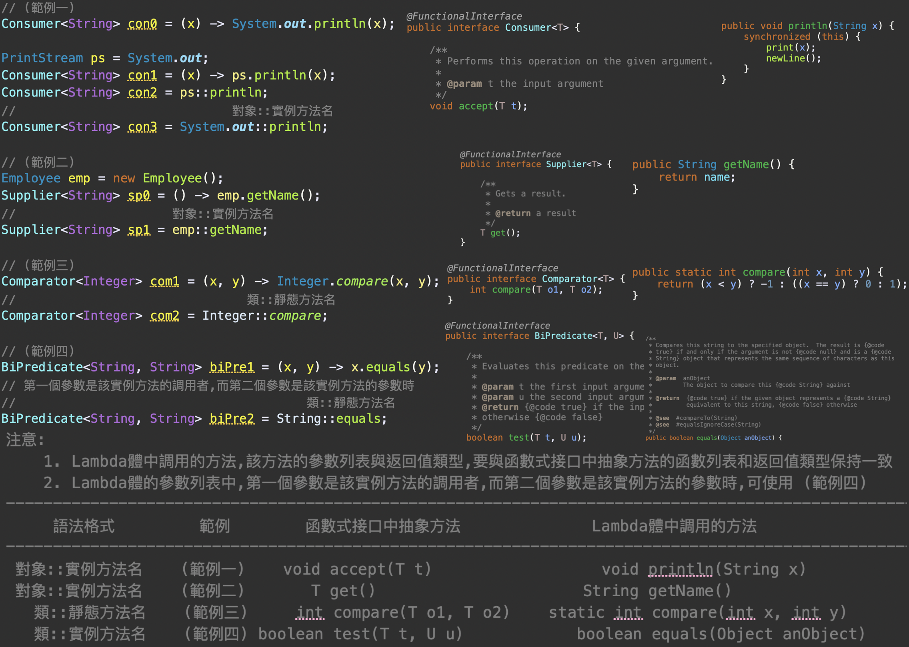

Java 8 新特性
==================
*   [Lambda 表達式](#ch01)
*   [Lambda 表達式基本介紹](#ch02)
*   [Java 8 內置四大核心函數式接口](#ch03)
*   [Java 8 內置其他函數式接口](#ch04)
*   [Java 8 強大的Stream API](#ch05)
*   [Java 8 串型流 與 並行流](#ch06)
*   [Optional<T>類](#ch07)
*   [Java 8 接口(Interface)中的默認方法與靜態方法](#ch08)
*   [Java 8 全新的時間日期API](#ch09)

* * *
<h2 id="ch01">1. Lambda 表達式</h2>

Lambda表達式 : 是一段可以傳遞的代碼(將代碼像數據一樣進行傳遞)可寫出更簡潔，靈活的代碼。

&nbsp;&nbsp;範例1.&nbsp;&nbsp;透過Lambda表達式，完成升冪排序。
  

&nbsp;&nbsp;範例2.&nbsp;&nbsp;取當前公司員工年紀大於35歲的員工訊息，獲取當前公司員工薪水大於500的員工訊息。

&nbsp;&nbsp;&nbsp;&nbsp;方法一:&nbsp;&nbsp;將每項條件寫成一個方法來做調用。
  

&nbsp;&nbsp;&nbsp;&nbsp;方法二:&nbsp;&nbsp;透過策略設計模式，各個條件實作一個過濾器的抽象類，將攏長且重複的代碼收整。
  

&nbsp;&nbsp;&nbsp;&nbsp;方法三:&nbsp;&nbsp;透過匿名內部類，來完成實作類的部分。
  

&nbsp;&nbsp;&nbsp;&nbsp;方法四:&nbsp;&nbsp;透過Lambda表達式來實作以下方法。
  

&nbsp;&nbsp;&nbsp;&nbsp;方法五:&nbsp;&nbsp;透過Stream API。
  

—————————————————————
<h2 id="ch02">2. Lambda 表達式基本介紹</h2>
—————————————————————

  

&nbsp;&nbsp;&nbsp;&nbsp;語法格式一：&nbsp;&nbsp;無參數無返回值。
  

&nbsp;&nbsp;&nbsp;&nbsp;語法格式二：&nbsp;&nbsp;一個參數，無返回值。
  

&nbsp;&nbsp;&nbsp;&nbsp;語法格式三：&nbsp;&nbsp;多個參數，有返回值(多條語句)。
  

&nbsp;&nbsp;&nbsp;&nbsp;語法格式四：&nbsp;&nbsp;Lambda表達式的參數列表內的數據類型可以省略不寫。JDK1.8有改善(類型推斷:JVM編譯器通過上下文推斷出數據類型)
  

&nbsp;&nbsp;&nbsp;&nbsp;函數式接口：&nbsp;&nbsp;
  

&nbsp;&nbsp;&nbsp;&nbsp;Lambda表達式相關練習題：&nbsp;&nbsp;
  

&nbsp;&nbsp;&nbsp;&nbsp;1.&nbsp;&nbsp;
  

&nbsp;&nbsp;&nbsp;&nbsp;2.&nbsp;&nbsp;
  

&nbsp;&nbsp;&nbsp;&nbsp;3.&nbsp;&nbsp;
  

—————————————————————
<h2 id="ch03">3. Java 8 內置四大核心函數式接口</h2>
—————————————————————

  

&nbsp;&nbsp;&nbsp;&nbsp;1:&nbsp;&nbsp;Consumer&lt;T&gt;
  

&nbsp;&nbsp;&nbsp;&nbsp;2:&nbsp;&nbsp;Supplier&lt;T&gt;
  

&nbsp;&nbsp;&nbsp;&nbsp;3:&nbsp;&nbsp;Function&lt;T&gt;
  

&nbsp;&nbsp;&nbsp;&nbsp;4:&nbsp;&nbsp;Predicate&lt;T&gt;
  

—————————————————————
<h2 id="ch04">4. Java 8 內置其他函數式接口</h2>
—————————————————————

  

&nbsp;&nbsp;&nbsp;&nbsp;1:&nbsp;&nbsp;Lambda體-方法引用
  

&nbsp;&nbsp;&nbsp;&nbsp;2:&nbsp;&nbsp;Lambda體-構造器引用
  

&nbsp;&nbsp;&nbsp;&nbsp;3:&nbsp;&nbsp;Lambda體-數組引用
  

—————————————————————
<h2 id="ch05">5. Java 8 強大的Stream API</h2>
—————————————————————

  

&nbsp;&nbsp;&nbsp;&nbsp;1:&nbsp;&nbsp;創建Stream
  

&nbsp;&nbsp;&nbsp;&nbsp;2:&nbsp;&nbsp;中間操作 
&nbsp;&nbsp;&nbsp;&nbsp;2-1:&nbsp;&nbsp;篩選與切片
  

&nbsp;&nbsp;&nbsp;&nbsp;2-2:&nbsp;&nbsp;映射 
&nbsp;&nbsp;&nbsp;&nbsp;2-2-1:&nbsp;&nbsp;map()映射
  

&nbsp;&nbsp;&nbsp;&nbsp;2-2-2:&nbsp;&nbsp;flatMap()映射
  
  

&nbsp;&nbsp;&nbsp;&nbsp;2-3:&nbsp;&nbsp;排序 
  

&nbsp;&nbsp;&nbsp;&nbsp;3:&nbsp;&nbsp;終止操作 
  
  
  
  

&nbsp;&nbsp;&nbsp;&nbsp;3-2:&nbsp;&nbsp;歸約 
  

&nbsp;&nbsp;&nbsp;&nbsp;3-3:&nbsp;&nbsp;收集 
  
  

—————————————————————
<h2 id="ch06">6. Java 8 串行流 與 並行流</h2>
—————————————————————

  

—————————————————————
<h2 id="ch07">7. Optional&lt;T&gt; 類</h2>
—————————————————————

  
  

—————————————————————
<h2 id="ch08">8. Java 8 接口(Interface)中的默認方法與靜態方法</h2>
—————————————————————

接口(Interface)多實現，類別(class)單繼承

  

—————————————————————
<h2 id="ch09">9. Java 8 全新的時間日期API</h2>
—————————————————————

  
  
  
  
