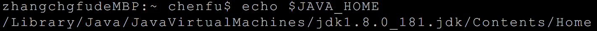
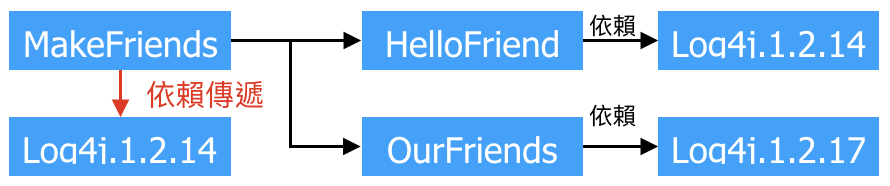

自動化構建工具 : Maven
==================
*   [目前掌握技術](#ch01)
*   [目前的技術在開發中存在的問題[Why]](#ch02)
*   [Maven是什麼[What]](#ch03)
    *   [構建](#ch03-02)
    *   [構建過程中的各種環節](#ch03-03)
*   [安裝Maven核心程序[Who]](#ch04)
*   [Maven的核心概念](#ch05)
*   [第一個Maven專案](#ch06)
*   [常用的Maven指令](#ch07)
*   [關於聯網問題](#ch08)
*   [POM](#ch09)
*   [座標](#ch10)
*   [倉庫](#ch11)
*   [依賴[基礎]](#ch12)
*   [生命週期](#ch13)
*   [在Eclipse中使用Maven](#ch14)
*   [依賴[進階]](#ch15)
*   [繼承](#ch16)
*   [聚合](#ch17)

* * *
<h2 id="ch01">1.目前掌握的技術</h2>

  
<h2 id="ch02">2.目前的技術在開發中存在的問題[Why]</h2>
I.&nbsp;&nbsp;一個項目就是一個大工程

    *   如果項目非常龐大，就不適合使用package的方式來劃分模塊。
    *   最好是每一個模塊對應一個工程，利於分工協作。
    *   借助於Maven就可以將一個項目拆分成多個工程。
II.&nbsp;&nbsp;項目中的jar包需要手動" CTRL + C "與" CTRL + V "到WEB-INF/lib目錄下

    *   帶來的問題是：相同的jar包文件重複出現在不同的項目工程中，一方便浪費存儲空間，另一方面也讓工程比較臃腫。
    *   借助Maven可以將jar包僅僅保存在"倉庫"中，有需要使用的工程引用這個文件接口，並不需要把jar包複製過來。
III.&nbsp;&nbsp;jar包需要別人替我們準備好或直接到官方網站下載

    *   不同技術的官方網站提供的jar包下載方式五花八門，有些技術的官方網站是通過Maven或SVN等...專門工具來提供下載。
    *   如果是以非正規的方式下載jar包，那麼其內容可能也是不可預期的。
    *   借助於Maven可以用一種規範的方式下載jar包，因為所有知名框架與第三方工具的jar包都是按照統一的規範存放在Maven的中央倉庫中。
    *   以統一規範的方式下載的jar包其內容也是可靠的。
Tips: "統一的規範"不僅對IT開發領域非常重要，對於整個人類社會都是非常重要的。

IV.&nbsp;&nbsp;一個jar包依賴著其他jar包需要自己手動加入到項目中

    *   FileUpload組件 -> IO組件
        Commons-fileupload-1.3.jar 依賴於 Commons-io-2.0.1.jar
            如果所有的jar包之間的依賴關係都需要工程師自己非常清楚的去了解，那麼就會增加極大的學習成本。
    *   Maven會自動將被依賴的jar包導入進來。
<h2 id="ch03">3.Maven是什麼[What]</h2>
I.&nbsp;&nbsp;Maven是一款服務於Java平台的自動化構建工具。
 &nbsp;&nbsp;構建工具歷史：

		Make -> Ant -> Maven -> Gradle

II.&nbsp;&nbsp;構建
 &nbsp;&nbsp;[1]概念:&nbsp;以Java源文件、框架配置文件、JSP、HTML、圖片等資源為"原材料"，去生產一個可以運行的項目的過程。
 &nbsp;&nbsp;[2]編譯:&nbsp;Java原文件[User.java]&nbsp;-->&nbsp;編譯&nbsp;-->&nbsp;Class字節文字檔[User.class]&nbsp;-->&nbsp;交由JVM去執行
 &nbsp;&nbsp;[3]部署:一個BS項目最終運行的並不是動態Web工程本身，而是這個動態Web工程"編譯結果"
 &nbsp;&nbsp;動態Web工程 ->&nbsp;編譯，部署&nbsp;->&nbsp;編譯結果

 
 開發過程中，所有的路徑或配置文件中配置的類路徑等都是以編譯結果的目錄結構為標準。
 Tips:運行時環境
 
 其實是一組jar包的引用，並沒有把jar包本身複製到工程中
 Tips: Pivotal tc Server Integeration for Eclipse (Eclipse插件)
 

III.&nbsp;&nbsp;構建過程中的各種環節

	[1]	清理: 將以前編碼得到的class字節碼文件刪掉，為下一次編譯做準備。
	[2]	編譯: 將Java源程序編譯成class字節碼文件。
	[3]	測試: 自動測試，自動調用JUnit程序。
	[4]	報告: 測試程序執行的結果。
	[5]	打包: 動態Web工程打包war包，Java工程打jar包
	[6]	安裝: (Maven特定的概念)將打包得到的文件複製到倉庫中指定位置
	[7]	部署: 將動態Web工程生成的war包複製到Servlet容器的指定目錄下，使其可以運行。
IV.&nbsp;&nbsp;自動化構建
<h2 id="ch04">4.安裝Maven核心程序[Who]</h2>
I.&nbsp;&nbsp;檢查環境變數(JAVA_HOME)

 II.&nbsp;&nbsp;解壓Maven核心程序的壓縮包，放在一個非中文無空格之路徑下。
 III.&nbsp;&nbsp;配置Maven相關的環境變量。
 
 IV.&nbsp;&nbsp;驗證&nbsp;mvn&nbsp;-v&nbsp;命令查看Maven版本。
 
<h2 id="ch05">5.Maven的核心概念</h2>

    [1]    約定的目錄結構
    [2]    POM
    [3]    座標
    [4]    依賴
    [5]    倉庫
    [6]    生命週期/插件/目標
    [7]    繼承
    [8]    聚合
<h2 id="ch06">6.第一個Maven專案</h2>
I.&nbsp;&nbsp;創建一個約定的目錄結構
 [1]Hello
 &nbsp;|---[2]src
 &nbsp;|----|---[4]main
 &nbsp;|----|----|---[6]java
 &nbsp;|----|----|---[7]resources
 &nbsp;|----|---[5]test
 &nbsp;|----|----|---[6]java
 &nbsp;|----|----|---[7]resources
 &nbsp;|---[3]pom.xml

    [1]    根目錄: 專案名稱
    [2]    src目錄: 程式源碼
    [3]    pom.xml: Maven工程的核心配置文件
    [4]    main目錄: 存放主程序
    [5]    test目錄: 存放測試程序
    [6]    java目錄: 存放Java源文件
    [7]    resources目錄: 存放框架或其他工具的配置文件
II.&nbsp;&nbsp;為什麼要遵守約定的目錄結構?
 Maven要負責該項目的自動化構建，以編譯為例Maven想要進行自動化構建，就必須知道Java源代碼保存的位置。
 若想告知框架或工具自訂義的東西在哪有兩種方式:

    [1]    以配置文件的方式明確告知 例如: classpath:spring-context.xml
    [2]    遵守框架或工具內部已存在的約定 例如: Log4j
    *開發上的優先順序    約定 > 配置 > 編碼
<h2 id="ch07">7.常用的Maven指令</h2>
I.&nbsp;&nbsp;注意&nbsp;:&nbsp;執行與構建過程相關的Maven指令，必須進入pom.xml同級層的目錄夾。
 &nbsp;&nbsp;與建構過程相關&nbsp;:&nbsp;編譯、測試、打包、...
 II.&nbsp;&nbsp;常用指令

    [1]    mvn clean : 清理
    [2]    mvn compile : 編譯主程序
    [3]    mvn test-compile : 編譯測試程序
    [4]    mvn test : 執行測試
    [5]    mvn package : 打包
    [6]    mvn install : 安裝
    [7]    mvn site : 生成站點

<h2 id="ch08">8.關於聯網問題</h2>
 I.&nbsp;&nbsp;Maven的核心程序中僅僅定義了抽象的生命週期，但是具體的工作必須由特定的插件來完成。而插件本身並不包含在Maven的核心程序中。
 II.&nbsp;&nbsp;當我們執行Maven指令需要用到某些插件時，Maven核心程序會首先到本地倉庫中查找。
 III.&nbsp;&nbsp;本地倉庫的默認位置:&nbsp;[當前使用者的家目錄]&nbsp;/.m2/repository
 IV.&nbsp;&nbsp;Maven核心程序在本地倉庫中找不到需要的插件，它會自動連接外網訪問中央倉庫去做下載。
 V.&nbsp;&nbsp;如果此時無法連接外網，則構建失敗。
 VI.&nbsp;&nbsp;修改默認本地倉庫的位置可以讓Maven核心程序至我們指定的目錄下查找插件

    [1]    找到Maven解壓後的目錄 /conf/setting.xml
    [2]    在setting.xml 找到 <localRepository>/path/to/local/repo</localRepository>
    [3]    將 <localRepository>/path/to/local/repo</localRepository> 從註解中取出
    [4]    將內容修改為自定義的目錄
&nbsp;&nbsp;`<localRepository>[你自定義的目錄路徑]</localRepository>`(如下圖所示) 

<h2 id="ch09">9.POM</h2>
I.&nbsp;&nbsp;含義&nbsp;:&nbsp;
 &nbsp;&nbsp;Project Object Model&nbsp;[POM]&nbsp;專案物件模型
 &nbsp;&nbsp;Document Object Model&nbsp;[DOM]&nbsp;文件物件模型
 II.&nbsp;&nbsp;pom.xml對於Maven專案是核心配置文件，該文件配置一切與構建過程相關的參數。
<h2 id="ch10">10.座標</h2>
I.&nbsp;&nbsp;數學中的座標&nbsp;:&nbsp;

    [1]在2D平面中，使用X,Y兩個向量，可以定位平面中的任何一個唯一點。
    [2]在3D空間中，使用X,Y,Z三個向量，可以定位空間中的任何一個唯一點。
II.&nbsp;&nbsp;Maven的座(GAV):
  使用以下三個向量作為在倉庫中，可以定位倉庫中的任何一個唯一的Maven專案。

    [1] <groupId>com.chenfu.maven</groupId> groupId : 公司或組織域名倒序＋項目名稱 
    [2] <artifactId>Hello</artifactId>   artifactId : 模塊名 
    [3] <version>0.0.1-SNAPSHOT</version>   version : 版本 
III.&nbsp;&nbsp;Maven專案的座標與倉庫中路徑的對應關係
 &nbsp;&nbsp;Maven專案座標&nbsp;:&nbsp;

    <groupId>org.springframework</groupId>
    <artifactId>spring-core</artifactId>
    <version>4.3.9.RELEASE</version>
&nbsp;&nbsp;倉庫路徑&nbsp;:&nbsp;
 `org/springframework/spring-core/4.3.9.RELEASE/spring-core-4.3.9.RELEASE.jar`
<h2 id="ch11">11.倉庫</h2>
I.&nbsp;&nbsp;倉庫的分類&nbsp;:&nbsp;
 &nbsp;[1]本地倉庫&nbsp;:&nbsp;當前電腦上部署的倉庫目錄，為當前電腦上所有Maven專案服務。
 
 &nbsp;[2]本地倉庫&nbsp;:&nbsp;
    
    [1] 私服 : 搭建在區域網路環境中，為區域網路範圍內所有的Maven專案服務。
    [2] 中央倉庫 : 架設在Internet上，為全世界所有Maven專案服務。
    [3] 中央倉庫的鏡像 : 分擔中央倉庫的流量，減輕主機壓力，提升用戶讀取的速度。

II.&nbsp;&nbsp;倉庫保存的內容&nbsp;:&nbsp;Maven專案

    [1] Maven本身所需的插件
    [2] 第三方框架或工具的jar包 (第一方 : jdk 第二方 : 自己)
    [3] 自己開發的Maven專案
<h2 id="ch12">12.依賴[基礎]</h2>
I.&nbsp;&nbsp;Maven解析座標時會到本地倉庫中查找被依賴的jar包
 II.&nbsp;&nbsp;依賴的範圍: `<scope> </scope>`

|構建環節 \ `scopeTag`| compile |test| provided |
|:--------------:|:-------:|:-----:|:--------:|
|主程序(compile)|有效|無效|有效|
|測試程序(test-Compile)|有效|有效|有效|
|打包(package)|參與|不參與|不參與| 
|部署(install)|參與|不參與|不參與| 
|典型範例  |spring-core.jar|junit.jar|servlet-api.jar|

Tips:&nbsp;provided 與 compile 對於Maven專案的差別

<h2 id="ch13">13.生命週期</h2>
 I.&nbsp;&nbsp;不能打亂構建順序，必須按照正確的順序來執行。
 II.&nbsp;&nbsp;抽象的生命週期中各項任務是由插件所完成。
 III.&nbsp;&nbsp;執行各個環節的構建是從最初的位置開始。
 IV.&nbsp;&nbsp;Maven有三套相互獨立的生命週期
 ＊`Clean Lifecycle`&nbsp;&nbsp;在進行真正的構建之前執行一些清理工作。

    [1] pre-clean 執行一些需要在clean之前完成的工作。
    [2] clean 移除所有上一次構建生成的文件。
    [3] post-clean 執行一些需要在clean之後立刻完成的工作。
 ＊`Site Lifecycle`&nbsp;&nbsp;生成項目報告,站點,發布站點。

    [1] pre-site 執行一些需要在生成站點文檔之前完成的工作。
    [2] site 生成項目的站點文檔
    [3] post-site 執行一些需要在生成站點文檔之後完成的工作，並且為部署做準備。
    [4] site-deploy 將生成的站點文件部署到特定的服務器上。
 ＊`Default Lifecycle`&nbsp;&nbsp;構建的核心部分也是生命週期中最中要的一個，絕大部分工作都發生在這個生命週期中。 例如:編譯,測試,打包,安裝,部署。

    validate
    generate-sources
    process-sources
    generate-resources
    process-resources 複製並處理資料文件，至目標目錄，準備打包。
    compile 編譯項目的源代碼
    process-classes
    generate-test-sources
    process-test-sources
    generate-test-resources
    process-test-resources 複製並處理資源文件，至目標測試目錄。
    test-compile 編譯測試源代碼
    process-test-class
    test 使用合適的單元測試框架運行測試，這些測試代碼不會被打包與部署。
    prepare-package
    package 接受編譯好的代碼，打包成可發布的格式。如:jar,war.....
    pre-integration-test
    integration-test
    post-integration-test
    verify
    install 將包安裝至本地倉庫，使其他項目依賴。
    deploy 將最終的包複製到遠程的倉庫，使其他開發人員與項目共享或部署到服務器上運行。

 V.&nbsp;&nbsp;插件和目標

    [1]生命週期的各個階段僅僅定義了要執行的任務。
    [2]各個階段和插件的目標是對應的。
    [3]相似的目標由特定的插件來完成。
    [4]可以將目標看作"調用插件功能的命令"

<h2 id="ch14">14.在Eclipse中使用Maven</h2>
 I.&nbsp;&nbsp;Maven插件:&nbsp;Eciplse內建
 II.&nbsp;&nbsp;Maven插件的設置:

    [1] installations:指定Maven核心程序位置。不建議使用Eclipse自帶的Maven程序，因使用自行解壓縮的那包。
    [2] User Setting:指定 conf/settings.xml 的位置，進而設定本地倉庫的位置。
`Maven 預設 JDK 1.8 `

    <profile>
      <id>jdk-1.8</id>
      <activation>
        <activeByDefault>true</activeByDefault>
        <jdk>1.8</jdk>
      </activation>
        <properties>
          <maven.compiler.source>1.8</maven.compiler.source>
          <maven.compiler.target>1.8</maven.compiler.target>
          <maven.compiler.compilerVersion>1.8</maven.compiler.compilerVersion>
      </properties>
    </profile> 

<h2 id="ch15">15.依賴[進階]</h2>
 I.&nbsp;&nbsp;依賴的傳遞性:

 &nbsp;[1].好處:可以傳遞的依賴，不必在每個模塊專案中都重複導入，在"底層(基層)"的專案模塊中導入一次即可。
 &nbsp;[2].注意:scope屬性必須為compile才能傳遞，若有需要就得在各專案模塊中分別導入。
 II.&nbsp;&nbsp;依賴的排除:
 &nbsp;[1]需要設置的情況:

 &nbsp;[2]依賴排除的設置方式(只限定該專案與依賴該專案的專案)

    <exclusions>
        <exclusion>
            <groupId>commons-logging</groupId>
            <artifactId>commons-logging</artifactId>
        </exclusion>
    </exclusions>

 III.&nbsp;&nbsp;依賴的原則:
 `[1] 作用 : 解決模塊專案之間jar包衝突問題`
 `[2] 情況假設1 : 驗證路徑最短優先原則`

 `[3] 情況假設2 : 驗證路徑相同時，先聲明者優先`先聲明者定義:在pom.xml的dependency標籤的聲明順序

 IV.&nbsp;&nbsp;統一管理依賴的版本:
 `[1]情境舉例`:
 &nbsp;&nbsp;假設Spring各個jar包的依賴版本都是4.0.0，此時如果需要統一升級時請問該怎麼處理?
 `[2]建立一種配置方式`
 &nbsp;&nbsp;1.使用properties標籤的自定義標籤統一聲明系統

     <properties>
              <chenfu.spring.version>4.3.9.RELEASE</chenfu.spring.version>
    </properties>
 &nbsp;&nbsp;2.在需要聲明統一版本的位置，使用`${自定義標籤名}`引用聲明的版號

    <dependency>
        <groupId>org.springframework</groupId>
        <artifactId>spring-context</artifactId>
        <version>${chenfu.spring.version}</version>
    </dependency>
 `[3]properties標籤`:需要統一聲明的場合都可以使用，類似網頁EL的樣板文字。

     <properties>
        <chenfu.spring.version>4.3.9.RELEASE</chenfu.spring.version>
        <project.build.sourceEncoding>UTF-8</project.build.sourceEncoding>
    </properties>
<h2 id="ch16">16.繼承</h2>

    I.  現況
        Hello       依賴junit: 4.0
        HelloFriend 依賴junit: 4.0
        MakeFriends 依賴junit: 4.9
        ＊ test範圍的依賴不能傳遞，必然會分散在各個模塊工程中，很容易造成版本不一致。 ＊
 `II.  需求:`統一管理各個模塊工程中對junit依賴的版本。
 `III.  解決的方法:` &nbsp;&nbsp;將junit依賴版本統一提交到"父"專案(基/底層)，在"子"專案聲明依賴時不指定版本，依父專案中統一設定為準，同時也便於修改。
 IV.&nbsp;&nbsp;操作步驟
 &nbsp;[1]  創造一個Maven專案為父專案。(注意:打包方式為pom)

     <groupId>com.chenfu.maven</groupId>
     <artifactId>Parent</artifactId>
     <version>0.0.1-SNAPSHOT</version>
     <packaging>pom</packaging>
 &nbsp;[2]  在子專案中聲明對父專案的引用。

    <!-- 子專案中聲明父專案 -->
    <parent>
        <groupId>com.chenfu.maven</groupId>
        <artifactId>Parent</artifactId>
        <version>0.0.1-SNAPSHOT</version>
    <!-- 指到父專案的pom.xml路徑 -->
        <relativePath>../Parent/pom.xml</relativePath>
    </parent>
 &nbsp;[3]  將子專案座標中與父專案座標中重複的內容刪除。

 &nbsp;[4]  在父專案中統一管理junit的依賴。

    <!-- 配置依賴的管理 -->
    <dependencyManagement>
        <dependencies>
            <dependency>
                <groupId>junit</groupId>
                <artifactId>junit</artifactId>
                <version>4.0</version>
                <scope>test</scope>
            </dependency>
        </dependencies>
    </dependencyManagement>
 &nbsp;[5]  在子專案中刪除junit依賴的版本號部分。

 `*注意:配置繼承後，執行安裝命令時要先安裝父專案。`

<h2 id="ch17">17.聚合</h2>
 `I.  作用:`一鍵安裝各個模塊專案。
 `II.  配置方式:`在一個`總的聚合專案`中配置各個參與聚合的模塊。

    <modules>
    <!-- 指定各個專案的相對路徑 -->
        <module>../Hello</module>
        <module>../HelloFriend</module>
        <module>../MakeFriends</module>
    </modules>
 `III.  使用方式:`在聚合專案的pom.xml上點右鍵&nbsp;->&nbsp;Run&nbsp;As&nbsp;->Maven&nbsp;install。

<h2>補充:Maven的Web工程自動部署</h2>(Tips:該方法適合使用非IDE介面的開發環境。)
 (專門研究啟動Servlet容器的一個組織) https://codehaus-cargo.github.io/cargo/Home.html
 I. 配置順序

    [1]配置cargo插件包
    [2]配置容器的位置(Tomcat,JBoss...)
    [3]配置容器端口號(Tomcat預設8080)
    [4]配置插件的觸發時機
 使用Maven的build標籤，將Dynamic Web Project編譯完成後自動導入Servlet。

    <build>
    <finalName>chenfuWeb</finalName>
    <!-- 配置構建專案中需要使用的插件 -->
        <plugins>
            <plugin>
            <!-- cargo是ㄧ個專門研究啟動Servlet容器的一個組織 -->
                <groupId>org.codehaus.cargo</groupId>
                <artifactId>cargo-maven2-plugin</artifactId>
                <version>1.5.0</version>
                <!-- 針對該插件進行配置 -->
                <configuration>
                    <!-- 配置當前系統中容器的位置 -->
                   <container>
                        <containerId>tomcat8x</containerId>
                        <home>/Users/chenfu/_JSP/apache-tomcat-8.0.53</home>
                    </container>
                    <configuration>
                        <type>existing</type>
                        <home>/Users/chenfu/_JSP/apache-tomcat-8.0.53</home>
                        <!-- 如果Tomcat端口為默認值8080則不必設置該屬性 -->
                        <!-- <properties> -->
                        <!-- <cargo.servlet.port>8989</cargo.servlet.port> -->
                        <!-- </properties> -->
                    </configuration>
                </configuration>
                <!-- 配置插件在甚麼情況下執行 -->
                <executions>
                    <!-- 簡單來說當Maven生命週期執行到install時,要執行插件的run方法 -->
                    <execution>
                        <id>cargo-run</id>
                        <!-- maven生命週期的階段 -->
                        <phase>install</phase>
                        <goals>
                            <!-- 插件該執行方法 -->
                            <goal>run</goal>
                        </goals>
                    </execution>
                </executions>
            </plugin>
        </plugins>
    </build>
  
