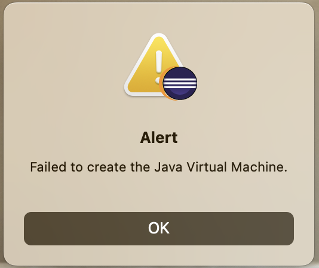
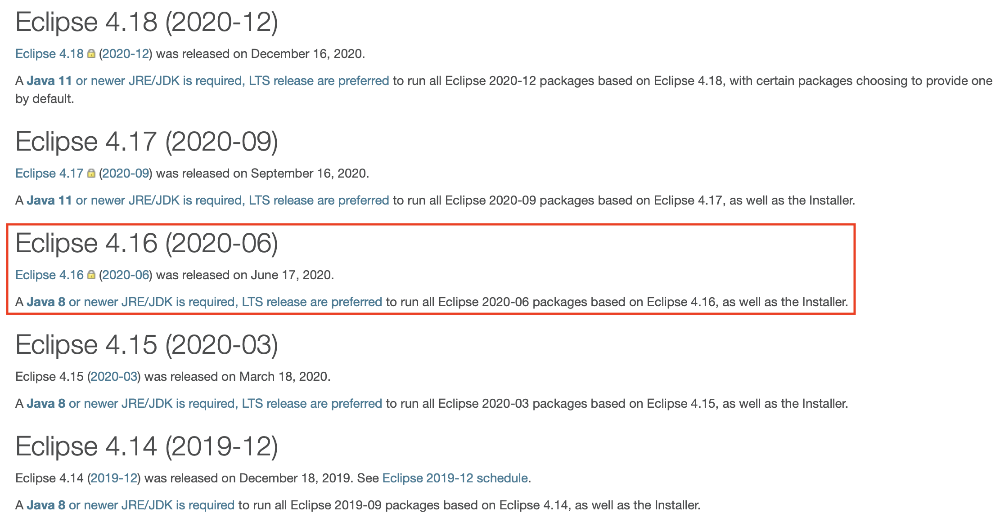
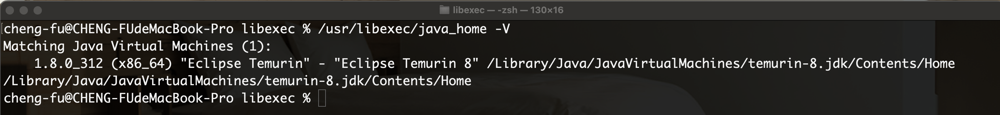
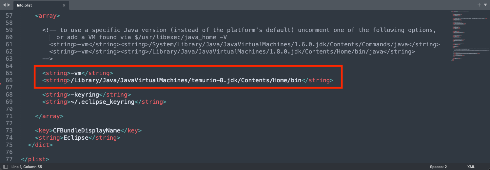
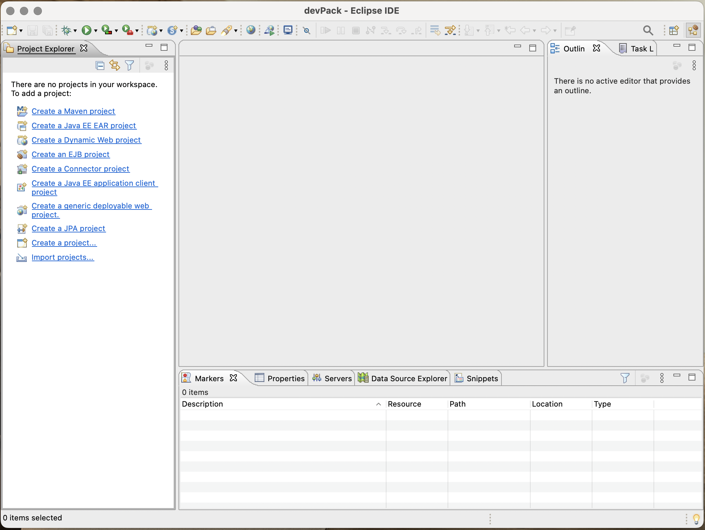
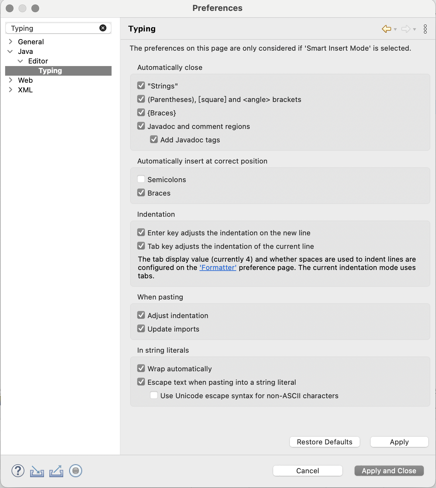
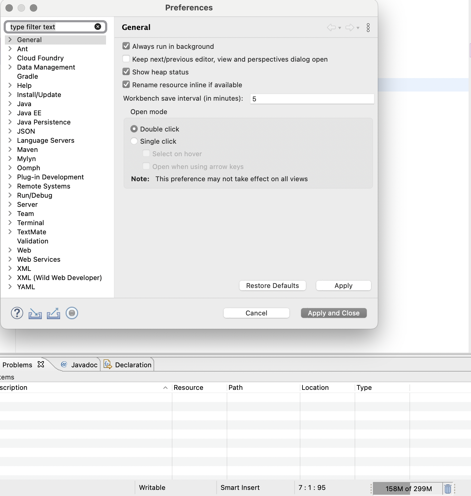

開發環境與工具使用問題
==================
*   [Eclipse - Failed to Create the Java Virtual Machine](#ch01)
*   [Eclipse - Escape text when pasting into s string literal](#ch02)
*   [Eclipse - Show heap status](#ch03)

* * *
<h2 id="ch01">Eclipse - Failed to Create the Java Virtual Machine.</h2>

  

I.&nbsp;&nbsp;問題說明

    *   啟動Eclipse時發生創建Java Virtual Machine (JVM)的問題。 

II.&nbsp;&nbsp;確認IDE環境

    *   IDE環境 Eclipse 4.16 (2020-06) JDK版本最低要求為 JDK1.8 (Java 8) 
  

Tips: Eclipse/Installation <https://wiki.eclipse.org/Eclipse/Installation>

II.&nbsp;&nbsp;確認本地環境

    *   本地環境 Eclipse Temurin 8 (OpenJDK 8)
  

III.&nbsp;&nbsp;設置IDE工具使用的VM內容

    *   不使用IDE工具預設的VM位置，重新設置為本地環境 Eclipse Temurin 8的路徑
    *       文件路徑 : Eclipse.app/Contents/Info.plist
  

IV.&nbsp;&nbsp;再次啟動Eclipse

  

<h2 id="ch02">Escape text when pasting into s string literal</h2>
I.&nbsp;&nbsp;複製貼上字串時會自動添加跳脫字元

    *   Preferences -> Java -> Editor -> Typing -> Escape text when pasting into s string literal
  

<h2 id="ch03">Show heap status</h2>
I.&nbsp;&nbsp;顯示IDE工具記憶體即時使用率

    *   Preferences -> General -> Show heap status
  

