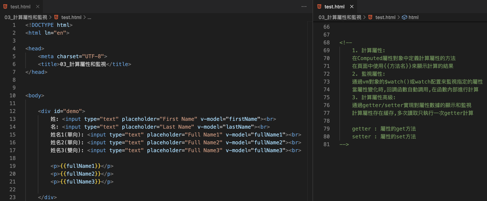
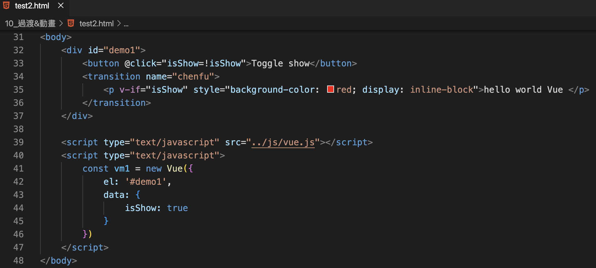

Vue : 漸進式JavaScript框架
==================
*   [第1章:Vue核心]
*   [1.1 Vue的基本認識](#ch01-01)
*   [1.2 模板語法](#ch01-02)
*   [1.3 計算屬性與監聽](#ch01-03)
*   [1.4 class與type綁定](#ch01-04)
*   [1.5 條件渲染](#ch01-05)
*   [1.6.1 列表渲染](#ch01-06-01)
*   [1.6.2 列表渲染_過濾與排序](#ch01-06-02)
*   [1.7 事件處理](#ch01-07)
*   [1.8 表單自動搜集](#ch01-08)
*   [1.9 Vue生命週期](#ch01-09)
*   [1.10 過度&動畫](#ch01-10)
*   [1.11 過濾器(filter)](#ch01-11)
*   [1.12 常用指令](#ch01-12)

* * *
<h2 id="ch01-01">1.1 Vue的基本認識</h2>

I.&nbsp;&nbsp;介紹描述

    *   漸進式JavaScript框架
    *   動態構建用戶介面:後端數據動態顯示在前端畫面
    *   借鏡 Angular模板和數據綁定技術
    *   借鏡 React組件化和虛擬DOM技術

II.&nbsp;&nbsp;Vue的特點

    *   遵循MVVM模式
    *   編碼簡潔誒,體積小,運行效率高,適合移動裝置與PC裝置
    *   著重在UI設計,可以輕鬆引入Vue插件與外部開發項目
官方網站: 
 &nbsp;&nbsp;(英文版)https://vuejs.org
 &nbsp;&nbsp;(中文版)https://cn.vuejs.org

III.&nbsp;&nbsp;Vue的擴展插件

    *   vue-cli : vue腳手架 
    *   vue-resource(axios) : ajax請求
    *   vue-router : 路由
    *   vuex : 狀態管理
    *   vue-lazyload : 圖片懶加載
    *   vue-scroller : 頁面滑動相關
    *   mint-ui : 基於vue的UI組件庫(移動端)
    *   element-ui : 基於vue的UI組件庫(PC端)

IV.&nbsp;&nbsp;開發者工具 (Vue.js devTool) : https://chrome.google.com/webstore/detail/vuejs-devtools/nhdogjmejiglipccpnnnanhbledajbpd
  
V.&nbsp;&nbsp;聲明式渲染
Vue.js核心是個允許採用簡潔的模版語法來聲明式的將數據渲染進DOM系統。

    *   1. 引入Vue.js 
    *   2. 創建Vue對象
    *      el : 指定根element(選擇器)
    *    data : 初始化數據(頁面可訪問)
    *   3. 雙向數據綁定 : v-model
    *   4. 顯示數據 : {{xxx}}
    *   5. 理解vue的mvvm實現

  

VI.&nbsp;&nbsp;理解Vue的MVVM
  

    *   View         (視圖): 模板頁面(展示數據)
    *   ViewModel (視圖模型): Vue的實例
    *   model        (模型): 數據對象(data)

* * *
<h2 id="ch01-02">1.2 模板語法</h2>

  
  

<h2 id="ch01-03">1.3 計算屬性與監聽</h2>

  
  

<h2 id="ch01-04">1.4 class與type綁定</h2>

  
  

<h2 id="ch01-05">1.5 條件渲染</h2>

  

<h2 id="ch01-06-01">1.6.1 列表渲染</h2>

  
  

<h2 id="ch01-06-02">1.6.2 列表渲染_過濾與排序</h2>

  
  

<h2 id="ch01-07">1.7 事件處理</h2>

  
  

<h2 id="ch01-08">1.8 表單自動搜集</h2>

  
  

<h2 id="ch01-09">1.9 Vue生命週期</h2>

  
  

<h2 id="ch01-10">1.10 過度&動畫_1</h2>

  
  

<h2 id="ch01-10">1.10 過度&動畫_2</h2>

  
  

<h2 id="ch01-11">1.11 過濾器(filter)</h2>

  
  

<h2 id="ch01-12">1.12 常用指令_1</h2>

  
  

<h2 id="ch01-12">1.12 常用指令_2</h2>

  
  