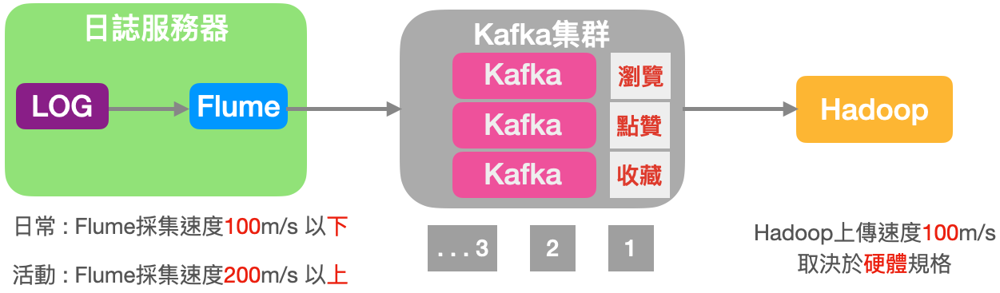
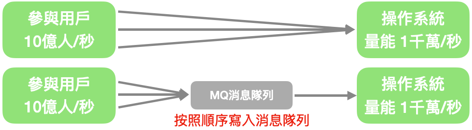
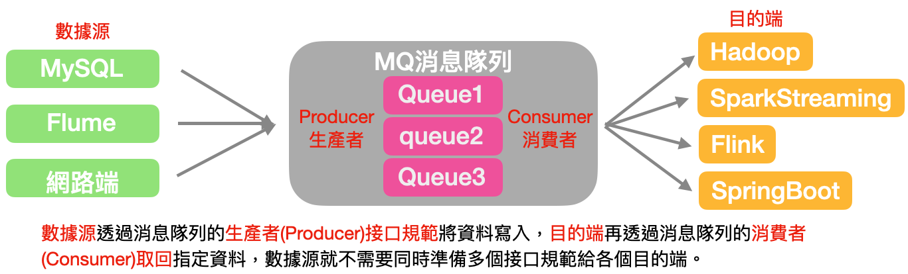
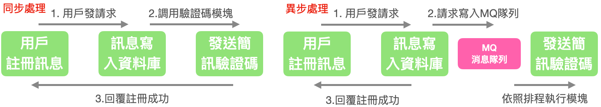
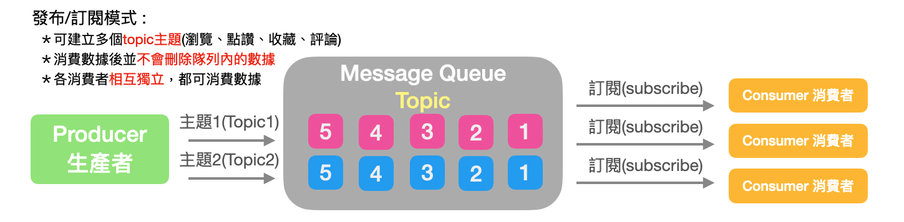
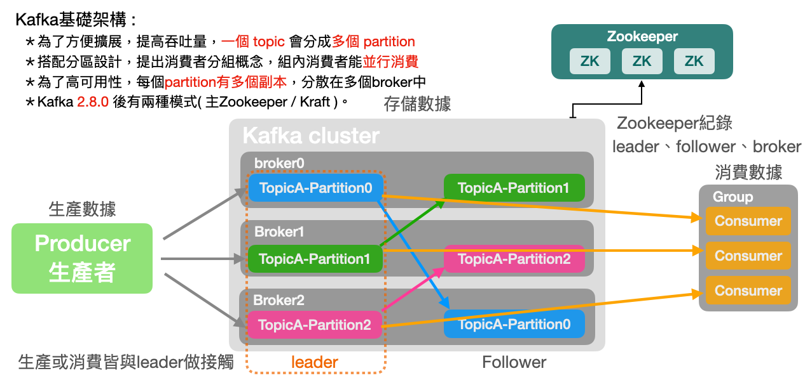

# Kafka 3.X 從入門到精通
==================
<h1 id="home">目錄</h1>

[ 第一章: 入門 ]  
[01_01 Kafka 概述](#01_01)  
[01_02 Kafka 快速入門](#01_02)  
[01_03 Kafka 生產者](#01_03)  
[01_04 Kafka Broker](#01_04)  
[01_05 Kafka 消費者](#01_05)  
[01_06 Kafka Eagle監控](#01_06)  
[01_07 Kafka Kraft模式](#01_07)  

[ 第二章: 外部系統集成 ]  
[02_01 集成 Flume](#02_01)  
[02_02 集成 Flink](#02_02)  
[02_03 集成 SpringBoot](#02_03)  
[02_04 集成 Spark](#02_04)  

[ 第三章: 生產優化手冊 ]  
[03_01 Kafka 硬體配置](#03_01)  
[03_02 Kafka 生產者](#03_02)  
[03_03 Kafka Broker](#03_03)  
[03_04 Kafka 消費者](#03_04)  
[03_05 Kafka 總體](#03_05)  

[ 第四章: 源碼解析 ]  
[04_01 源碼環境](#04_01)  
[04_02 源碼(生產者)](#04_02)  
[04_03 源碼(消費者)](#04_03)  
[04_04 源碼(服務器)](#04_04)  

* * *
<h2 id="01_01">01: Kafka 概述</h2>
Kafka 傳統定義 : Kafka 主要應用於大數據實時處理的環境，是個分布式的基於發布/訂閱模式的消息隊列(Message Queue)。
 發布/訂閱 : 消息的發布者不會將消息直接發送給特定的訂閱者，而是將消息分為不同的類別，訂閱者只接收感興趣的消息。

 

    Kafka最新定義:
    (1) 開源的分布式事件流平台(Event Streaming Platform)。
    (2) 用於高性能 數據管道、流分析、數據集成、關鍵任務應用。
消息隊列 : 目前常見的消息隊列產品中有 Kafka、ActiveMQ、RabbitMQ、RocketMQ等。在大數據環境主要使用Kafka作為消息隊列。

傳統的消息隊列主要的應用場景包括: 緩衝/消峰、解耦、異步通信。

緩衝/消峰 : 有助於控制與優化數據經過系統的速度，解決生產消息與消費消息處理速度不一致狀況。

 

解耦 : 允許獨立擴展或修改兩邊的處理過程，必須確保兩邊遵守相同的接口約束。

 

異步通信 : 允許用戶將消息放入隊列中，隊列隨即發送響應成功，該消息依照隊列的排程進度依序處理。

 

消息隊列共有以下兩種模式:

1)點對點模式:生產者(Producer)將消息依序發送到隊列(Message Queue)中，消費者(Customer)依序提取
隊列(Message Queue)中的消息，確認收到消息後主動通知隊列刪除已發送的消息於隊列中。
 

2)發布/訂閱模式:可以創建多個Topic主題(瀏覽、點贊、收藏、評論等)，消費者取得消息後並不會刪除該消息，每個消費者都能提取到相同的消息。
 

kafka基礎架構:
 

* * *
<h2 id="01_02">02: Kafka 快速入門</h2>

<h2>02_01 Kafka 安裝部署</h2>
<h3>02_01_01 集群規劃</h3>

|  |  |  |
| :----: | :----: | :----: |
| hadoop101 | hadoop102 | hadoop103 |
| ZooKeeper | ZooKeeper | ZooKeeper |
| Kafka | Kafka | Kafka |

<h3>02_01_02 集群部署</h3>

[官方下載地址](https://kafka.apache.org/downloads "官方下載地址")

Kafka版本說明: Producer生產者與Customer消費者皆使用java語言撰寫，brocker則是使用Scala語言。

kafka_2.12-3.5.1.tgz (Kafka版本: 3.5.1、Scala使用版本: 2.12)

1)解壓安裝包

    tar -zxvf kafa_2.12-3.0.0.tgz -C /opt/module/

2)修改資料夾名稱

    mv kafa_2.12-3.0.0/ kafka

3)修改配置文件

    vim config/server.properties

    #broker是全局唯一編號，不能重複只能是數字。
     broker.id = 0
    #網路請求的連線數量
     num.network.threads = 3
    #硬碟IO的線程數量
     num.io.threads = 8
    #發送緩存區大小
     socket.send.buffer.bytes = 102400
    #接收緩存區大小
     socket.receive.buffer.bytes = 102400
    #請求緩存區大小
     socket.request.max.bytes = 104857600
    #Kafka運行日誌(log)不需要提前創建Kafka會自動創建，可以配置多個硬碟路徑之間可用" , "做分割
     log.dirs=/opt/module/kafka/datas,/opt/module/log
    #Topic在當前broker上的分區數量
     num.partitions = 1
    #用來恢復和清理data下數據的線程數量
     num.recovery.threads.per.data.dir = 1
    #每個topic創建時的副本數量(預設為1)
     offsets.topic.replication.factor = 1
    #segment文件保留的最長時間，超過後將被刪除
     log.retention.hours = 168
    #每個segment文件的大小(預設為1G)
     log.segment.bytes = 1073741824
    #檢查過期數據的時間週期(預設為5分鐘)
     log.retention.check.interval.ms = 300000
    #配置連接Zookeeper集群地址(在ZK根目錄下建立/kafka方便管理)
     zookeeper.connect = 伺服器名稱:Port號碼,伺服器名稱:Port號碼,伺服器名稱:Port號碼/kafka

4)新增環境變數

    #KAFKA_HOME
    export KAFKA_HOME=KAFKA目錄路徑
    export PATH=$PATH:$KAFKA_HOME/bin

    立即更新環境變數
    source /etc/profile

<h2>02_02 Kafka 命令操作</h2>
<h3>02_02_01 Kafka 主題命令操作(Topic)</h3>

    腳本命令 : bin/kafka-topics.sh

| 參數名稱 |  說明  |
| :------ | :---- |
|  --bootsrtap-server < String : 主機名稱:端口號 > |連接的Kafka Broker主機名稱和端口號|
|  --topic < String : topic名稱 > |操作的topic名稱|
|  --create | 創建主題 |
|  --delete | 刪除主題 |
|  --alter | 修改主題 |
|  --list | 查看所有主題 |
|  --describe | 查看該主題詳細描述(Details) |
|  --partitions < Integer : partitions數量 > | 設置分區數量 |
|  --replication-factor < Integer : replication附量 > | 設置分區副本 |
|  --config < String:name=value > | 更新系統默認配置 |

<h3>02_02_02 Kafka 生產者命令操作(Producer)</h3>

    腳本命令 : bin/kafka-console-producer.sh

| 參數名稱 |  說明  |
| :------ | :---- |
|  --bootsrtap-server < String : 主機名稱:端口號 > |連接的Kafka Broker主機名稱和端口號|
|  --topic < String : topic名稱 > |操作的topic名稱|

<h3>02_02_03 Kafka 消費者命令操作(Consumer)</h3>

    腳本命令 : bin/kafka-console-consumer.sh

| 參數名稱 |  說明  |
| :------ | :---- |
|  --bootsrtap-server < String : 主機名稱:端口號 > |連接的Kafka Broker主機名稱和端口號|
|  --topic < String : topic名稱 > |操作的topic名稱|
|  --from-beginning |從頭開始消費|
|  --group < String : consumer group id > |指定消費組名稱|

