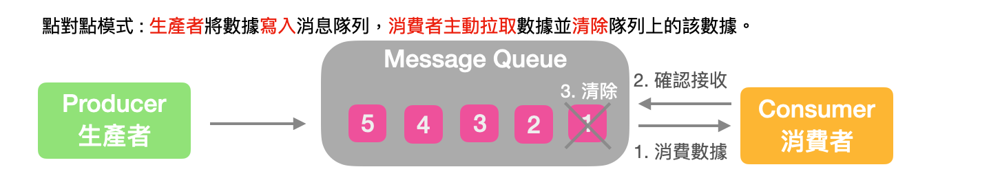

# Kafka 3.X 從入門到精通
==================
<h1 id="home">目錄</h1>

[ 第一章: 入門 ]  
[01_01 Kafka 概述](#01_01)  
[01_02 Kafka 快速入門](#01_02)  
[01_03 Kafka 生產者](#01_03)  
[01_04 Kafka Broker](#01_04)  
[01_05 Kafka 消費者](#01_05)  
[01_06 Kafka Eagle監控](#01_06)  
[01_07 Kafka Kraft模式](#01_07)  

[ 第二章: 外部系統集成 ]  
[02_01 集成 Flume](#02_01)  
[02_02 集成 Flink](#02_02)  
[02_03 集成 SpringBoot](#02_03)  
[02_04 集成 Spark](#02_04)  

[ 第三章: 生產優化手冊 ]  
[03_01 Kafka 硬體配置](#03_01)  
[03_02 Kafka 生產者](#03_02)  
[03_03 Kafka Broker](#03_03)  
[03_04 Kafka 消費者](#03_04)  
[03_05 Kafka 總體](#03_05)  

[ 第四章: 源碼解析 ]  
[04_01 源碼環境](#04_01)  
[04_02 源碼(生產者)](#04_02)  
[04_03 源碼(消費者)](#04_03)  
[04_04 源碼(服務器)](#04_04)  

* * *
<h2 id="01_01">01. Kafka 概述</h2>
Kafka 傳統定義 : Kafka 主要應用於大數據實時處理的環境，是個分布式的基於發布/訂閱模式的消息隊列(Message Queue)。
 發布/訂閱 : 消息的發布者不會將消息直接發送給特定的訂閱者，而是將消息分為不同的類別，訂閱者只接收感興趣的消息。

 

    Kafka最新定義:
    (1) 開源的分布式事件流平台(Event Streaming Platform)。
    (2) 用於高性能 數據管道、流分析、數據集成、關鍵任務應用。
消息隊列 : 目前常見的消息隊列產品中有 Kafka、ActiveMQ、RabbitMQ、RocketMQ等。在大數據環境主要使用Kafka作為消息隊列。

傳統的消息隊列主要的應用場景包括: 緩衝/消峰、解耦、異步通信。

緩衝/消峰 : 有助於控制與優化數據經過系統的速度，解決生產消息與消費消息處理速度不一致狀況。

 

解耦 : 允許獨立擴展或修改兩邊的處理過程，必須確保兩邊遵守相同的接口約束。

 

異步通信 : 允許用戶將消息放入隊列中，隊列隨即發送響應成功，該消息依照隊列的排程進度依序處理。

 

消息隊列共有以下兩種模式:

1)點對點模式:生產者(Producer)將消息依序發送到隊列(Message Queue)中，消費者(Customer)依序提取
隊列(Message Queue)中的消息，確認收到消息後主動通知隊列刪除已發送的消息於隊列中。
 

2)發布/訂閱模式:可以創建多個Topic主題(瀏覽、點贊、收藏、評論等)，消費者取得消息後並不會刪除該消息，每個消費者都能提取到相同的消息。
 

kafka基礎架構: