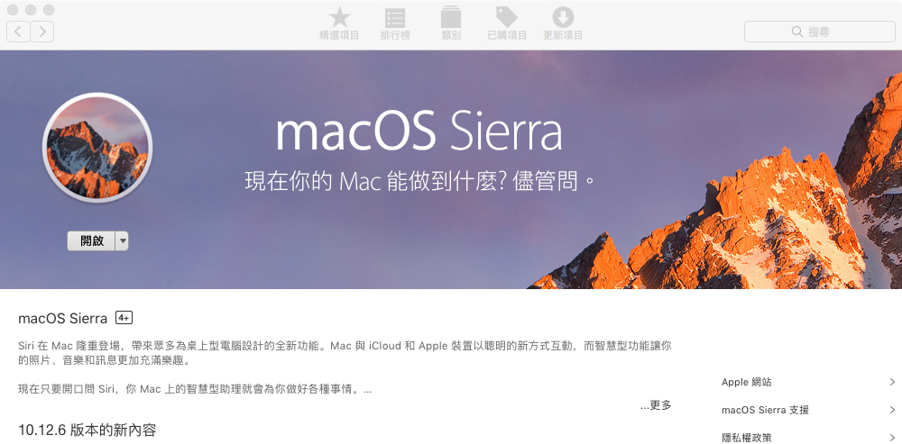

# Removable_USB_Drive_MacOS
製作一支ＭacOS USB : 
  1.準備一隻空的USB (至少8G) 
  2.MacOS 安裝程式 
  
步驟一： 
  開啟App Store 下載 mac os Sierra 安裝程式  
  
步驟二： 
  製作一支USB 
  Launchpad -> 其他 -> 磁碟工具程式 -> 清除  
  格式依照下圖（名稱隨意）  
  
步驟三： 
  準備2個Finder視窗 
   
   1.Finder -> 應用程式 
      (找到 安裝 macOS Sierra)  
   2.安裝 macOS Sierra 對圖示按右鍵 -> 顯示套件內容 -> Contents -> Resources 
      (找到Createinstallmedia) 
   3.開啟終端機 
      <依照下圖排列視窗>  
  
步驟四： 
 按下步驟在終端機輸入(不包含"") 
  1."sudo " 
  2.將Createinstallmedia 拖入終端機(路徑會自行輸入) 
  3." --volume " 
  4.將 USB 拖入終端機(路徑會自行輸入) 
  5." --applicationpath " 
  6.將 安裝 macOS Sierra 拖入終端機(路徑會自行輸入) 
  <結果如下圖> 
  
步驟五： 
  1.按下Enter送出 
  2.輸入密碼  
  3.輸入 "y"  
  4.一直等待大約半小時(看電腦狀態) 
    <結果如下圖> 
  
步驟六： 
<完成的結果如下圖> 
  
ps: 
因為會等很久,你可以點開USB的簡介觀察已使用量慢慢的變大   
  